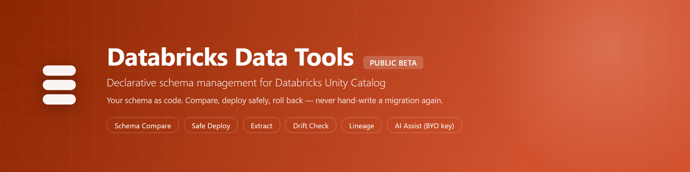
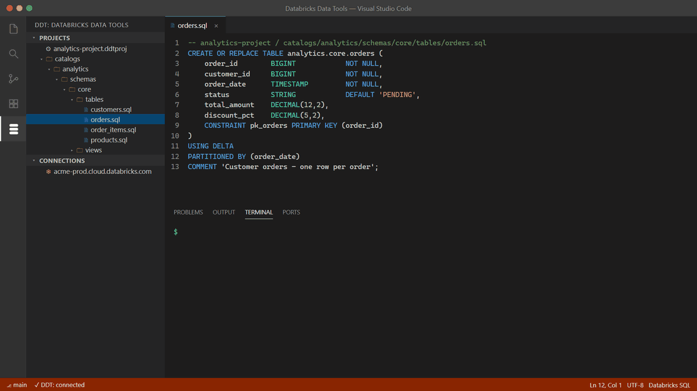
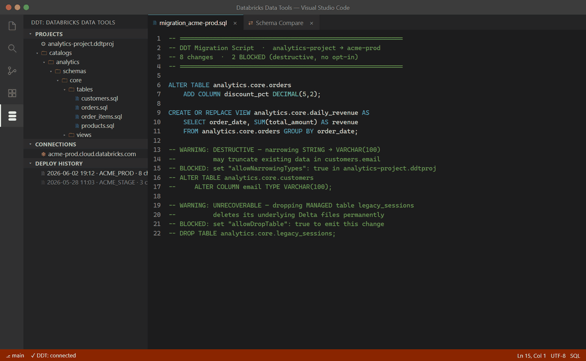

# DDT — Databricks Data Tools



[](https://marketplace.visualstudio.com/items?itemName=sdt-ddt-tools.ddt-vscode)
[](https://marketplace.visualstudio.com/items?itemName=sdt-ddt-tools.ddt-vscode)
[](https://www.npmjs.com/package/@ddt-tools/cli)

**Declarative schema management for Databricks Unity Catalog, from VS Code and the CLI.** Author your schema as `.sql` files, compare them against a live workspace, and deploy with a safety classifier that refuses to do dangerous things silently.

> **Public Beta** — all features are free during the 30-day beta. AI features are bring-your-own-API-key. See [Beta program](#beta-program) below.

This repository is the **public home** for DDT — release notes, privacy policy, support, and issue tracking. **The product source code is not published here.**

---

## What DDT is

Databricks ships building blocks — the SDK, the CLI, Terraform providers — but no end-to-end workflow for managing Unity Catalog schemas: no compare engine, no safety classification, no rollback story. DDT fills that gap. You author each UC object as a `.sql` file (a desired-state spec using `CREATE OR REPLACE`, the Databricks idiom), and DDT computes the deltas between your project and the live workspace — you never hand-write forward/backward migration files. Every proposed change is classified `SAFE`, `DESTRUCTIVE`, `EXPENSIVE`, or `UNRECOVERABLE`, and anything destructive refuses to run without an explicit opt-in. DDT understands UC-specific failure modes — dropping a streaming table loses its checkpoint cursor; dropping a managed table deletes its files — that generic SQL tools miss.

It is the Databricks counterpart to [SDT (Snowflake Data Tools)](https://github.com/GVOrganization/sdt-tools): same design, same CLI surface, so a team that knows one learns the other in a day.

**Highlights:**

- **Schema compare** — diff a project, a built `.ddtpac`, or a live Unity Catalog workspace in any direction, with per-change safety classification inline.
- **Safe deploy** — destructive operations gated behind explicit opt-ins; UC-aware safety (managed-table file deletion, streaming-table checkpoint loss, and more).
- **Extract / reverse-engineer** — pull a live workspace into a tree of `.sql` files.
- **Object Explorer, lint, format, lineage, drift check, deploy history.**
- **AI assist (bring your own key)** — sketch objects from a description, suggest safer alternatives for risky changes, and an "Ask DDT" chat panel.

> Databricks users predominantly drive DDT from the CLI and CI; the project lifecycle (init / build / publish / extract) lives in the `@ddt-tools/cli`, while the VS Code surface focuses on browsing, comparing, diagramming, and reviewing.

## See it in action

**Schema compare with a safety verdict on every change** — `SAFE` / `DESTRUCTIVE` / `EXPENSIVE` / `UNRECOVERABLE`, before anything touches your live workspace:



**Deploys that refuse to destroy data silently** — destructive changes come out blocked as comments until you opt in, and a DEEP CLONE makes every deploy one command away from rollback:



**Reverse-engineer an entire workspace in seconds** — one command, one `.sql` file per object, ready for git:


## Documentation

**[📚 Full documentation →](./docs/README.md)**

| Start | Core workflow | Reference | Help |
|---|---|---|---|
| [🚀 Getting started](./docs/getting-started.md) | [📥 Extract](./docs/extract.md) | [⌨️ CLI reference](./docs/cli-reference.md) | [❓ FAQ](./docs/faq.md) |
| [🔌 Connections](./docs/connections.md) | [🔍 Schema compare](./docs/schema-compare.md) | [🧩 VS Code reference](./docs/vscode-extension.md) | [🩹 Troubleshooting](./docs/troubleshooting.md) |
| [📁 Projects](./docs/projects.md) | [🛡️ Safe deploy](./docs/safe-deploy.md) | [⚙️ Configuration](./docs/configuration.md) | [💬 Support](./SUPPORT.md) |
| | [🚦 Safety classifier](./docs/safety-classifier.md) | [✨ AI features](./docs/ai-features.md) · [🔁 CI/CD](./docs/ci-cd.md) | |

## Install


- **VS Code extension:** install [**DDT — Databricks Data Tools**](https://marketplace.visualstudio.com/items?itemName=sdt-ddt-tools.ddt-vscode) from the VS Code Marketplace.
- **CLI:**

  ```sh
  npm install -g @ddt-tools/cli
  ddt --version
  ```

**Requirements:** VS Code 1.90+; Node.js 20+ for the CLI; works on Windows, macOS, and Linux. Connects to any workspace with **Unity Catalog** enabled (AWS, Azure, or GCP); PAT and OAuth machine-to-machine (M2M) auth supported.

## Beta program

DDT is in a **30-day public beta**. During the beta:

- **Every feature is free** — the full deterministic engine plus all AI write-side features.
- **AI features are bring-your-own-key** — your prompts go directly from your machine to your chosen AI provider under your own account; DDT never sees, proxies, or stores that traffic.
- **Please report bugs.** That's the whole point of a beta — see [SUPPORT.md](./SUPPORT.md). If you opted into automatic error reporting on first run, a crash may already have sent us a sanitized diagnostic; a GitHub issue with what you were doing still helps a lot.

After the beta the deterministic core (compare, safe deploy, extract, lint, format, lineage, Object Explorer, schema diagram) stays free; AI write-side and some ownership features move to a Pro tier. Details will be posted in [RELEASES.md](./RELEASES.md).

## Privacy

DDT's telemetry is **opt-in** and heavily sanitized — your SQL, identifiers, catalog/schema/table/column names, data, and credentials **never** leave your machine. AI features are bring-your-own-key with no AI subprocessor on our side. Full details: **[PRIVACY.md](./PRIVACY.md)**.

## Support

Bug reports, feature requests, and questions: **[SUPPORT.md](./SUPPORT.md)**. Quick paths: open a [GitHub issue](https://github.com/GVOrganization/ddt-tools/issues/new/choose), run `ddt feedback`, or email sdt.ddt.tools@gmail.com.

## Links

- Privacy policy: [PRIVACY.md](./PRIVACY.md)
- Support & help: [SUPPORT.md](./SUPPORT.md)
- Release notes: [RELEASES.md](./RELEASES.md)
- Sibling product (Snowflake): https://github.com/GVOrganization/sdt-tools

---

_DDT is an independent tool and is not affiliated with, endorsed by, or sponsored by Databricks Inc. "Databricks", "Unity Catalog", and "Delta Lake" are trademarks of Databricks Inc., used here for descriptive purposes only._
