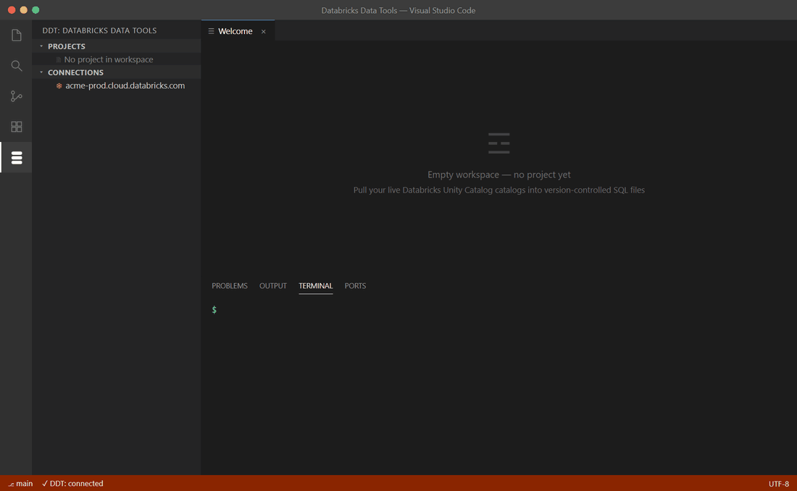

# 🚀 Getting started

> Go from install to your first safe deploy against a live Databricks workspace in about 15 minutes.

**On this page:** [Install](#install) · [Connect](#connect) · [Create or extract a project](#create-or-extract-a-project) · [First compare](#first-compare) · [First deploy](#first-deploy) · [Where to go next](#where-to-go-next)

---

## Install

Databricks Data Tools (DDT) ships as a command-line tool and a VS Code extension. They run the same engine.

> [!NOTE]
> The DDT VS Code extension is browse / compare / review-focused. The project lifecycle — init, extract, build, publish — is CLI-first. Install the CLI to follow the full workflow below.

### CLI

Install the `ddt` command globally from [npm](https://www.npmjs.com/package/@ddt-tools/cli):

```sh
npm install -g @ddt-tools/cli   # requires Node.js 20 or newer
```

Smoke-test it:

```sh
ddt --version
```

### VS Code extension

1. **Open the Extensions view** — press <kbd>Ctrl</kbd>+<kbd>Shift</kbd>+<kbd>X</kbd>.
2. **Search for `sdt-ddt-tools.ddt-vscode`** — or install directly from the [Marketplace listing](https://marketplace.visualstudio.com/items?itemName=sdt-ddt-tools.ddt-vscode).
3. **Reload VS Code** when prompted.

The extension gives you the object explorer, schema compare, diagrams, lineage, and review surfaces; you drive init/extract/build/publish from the CLI.

---

## Connect

A connection profile carries your workspace host, auth credentials, SQL warehouse ID, and default catalog / schema. Profiles live at `~/.ddt/profiles.json` and never store raw secrets.

The fastest start is a Personal Access Token (PAT) to validate end-to-end:

```sh
ddt connection add --name prod \
  --host adb-1234567890123456.7.azuredatabricks.net \
  --auth pat \
  --token env:DATABRICKS_TOKEN \
  --warehouse-id 1234abc5d678e9f0 \
  --catalog main \
  --schema bronze

ddt connection test prod   # confirms workspace, user, and warehouse
```

> [!TIP]
> See [Connecting to Databricks](connections.md) for every auth method (PAT and OAuth M2M today; U2M, Azure AD, and Google IDC documented), how to mint a token, and how to validate the connection.

---

## Create or extract a project



A DDT project is a folder of `.sql` files — one per object — described by a `.ddtproj` manifest. You can scaffold an empty project or extract one from a live workspace.

### Extract an existing workspace

`ddt extract` walks the Unity Catalog objects in the connection and writes one `.sql` file per object at its canonical path. This is the usual first step.

```sh
mkdir my-lakehouse-project && cd my-lakehouse-project

ddt init --name SampleAnalytics --scope catalog --catalog main
ddt extract --connection prod --output .
```

What you get:

```
.
├── SampleAnalytics.ddtproj                 # project manifest
├── catalogs/main/                          # one folder per UC catalog
│   ├── catalog.sql                         # CREATE CATALOG main;
│   └── schemas/
│       ├── gold/
│       │   ├── schema.sql
│       │   ├── tables/
│       │   │   ├── fact_sales.sql          # one file per table
│       │   │   └── dim_customer.sql
│       │   ├── views/
│       │   │   └── v_active.sql
│       │   └── streaming_tables/
│       │       └── events_st.sql
│       └── staging/
│           └── ...
└── scripts/
    ├── pre/
    └── post/
```

### Or scaffold a new project

`ddt init` creates the canonical layout with empty type folders, ready for you to author objects by hand. You author each object as a `.sql` file named for its fully-qualified name, using `CREATE OR REPLACE` — the Databricks idiom for Delta / Iceberg tables and UC functions.

### Validate the project

```sh
ddt validate -p ./SampleAnalytics.ddtproj
```

This reports the schema check and file-discovery count. If validation fails, the message includes the offending field path and constraint.

---

## First compare

`ddt compare` diffs two **`.ddtpac` build artifacts** (pac ↔ pac) and reports exactly what changed. Comparing a project or a live workspace directly is pending v0.3 — for now, `ddt build` each side into a pac first (extract the live side into a pac with `ddt extract --out-pac`).

Make a change first. Edit a table file — say, add a column to `catalogs/main/schemas/gold/tables/fact_sales.sql`. Then build a pac of your project, snapshot the live workspace into another pac, and compare the two:

```sh
ddt build -p ./SampleAnalytics.ddtproj
# Built ./bin/SampleAnalytics.ddtpac        (your desired state)

ddt extract --connection prod --out-pac ./bin/SampleAnalytics-live.ddtpac
# Snapshot of the live workspace             (the current state)

ddt compare \
  --source ./bin/SampleAnalytics.ddtpac \
  --target ./bin/SampleAnalytics-live.ddtpac
```

The compare shows every object grouped by type, badged added / removed / modified / unchanged, with field-level drill-down and safety findings classified UNRECOVERABLE / DESTRUCTIVE / EXPENSIVE / WARNING. In VS Code, the schema compare panel renders the same result.

---

## First deploy

A deploy generates a migration script from the diff and — when you opt in — executes it.

Always start with a dry run. It prints the full plan, safety assessment, and reverse-SQL coverage without running any SQL:

```sh
ddt publish \
  --source ./SampleAnalytics.ddtproj \
  --target ./bin/SampleAnalytics-live.ddtpac \
  --dry-run
```

You can also generate the migration SQL to a file and review it — every non-SAFE operation is wrapped in `-- WARNING:` comments:

```sh
ddt script \
  --source ./SampleAnalytics.ddtproj \
  --target ./bin/SampleAnalytics-live.ddtpac \
  --out ./deploy.sql
```

When the plan looks right, apply it:

```sh
ddt publish \
  --source ./SampleAnalytics.ddtproj \
  --target ./bin/SampleAnalytics-live.ddtpac \
  --apply --yes
```

> [!WARNING]
> `--apply` executes DDL against the live workspace. On Unity Catalog, dropping or rebuilding a **managed table deletes its underlying files**, and recreating a **streaming table loses its checkpoint state**. Destructive operations stay blocked until you explicitly opt in with the matching gate — `allowDropTable`, `allowUnrecoverableDrop`, and related options. See [Safe deploy](safe-deploy.md) and the [Safety classifier](safety-classifier.md).

On partial failure, the deploy walks completed steps in reverse and rolls back where every preceding step was reversible, reporting `CLEAN_SUCCESS`, `CLEAN_ROLLBACK`, `DIRTY`, or `PREFLIGHT_FAILED`.

---

## Where to go next

| Page | What it covers |
|---|---|
| [Connecting to Databricks](connections.md) | Every auth method, the profiles file, troubleshooting |
| [Projects & suites](projects.md) | Project layout, the `.ddtproj` manifest, multi-project suites |
| [Extract](extract.md) | Extracting a live workspace into a project in depth |
| [Schema compare](schema-compare.md) | Compare modes and the compare view |
| [Safe deploy](safe-deploy.md) | Dry-run, apply, rollback, deployment profiles |
| [Safety classifier](safety-classifier.md) | What UNRECOVERABLE / DESTRUCTIVE / EXPENSIVE / WARNING mean |
| [CLI reference](cli-reference.md) | Every command and flag |
| [VS Code extension reference](vscode-extension.md) | Browse, compare, and review surfaces |
| [CI/CD](ci-cd.md) | Wiring DDT into your pipeline |

---

**Next:** [Connecting to Databricks](connections.md) · **Up:** [Documentation home](README.md)
